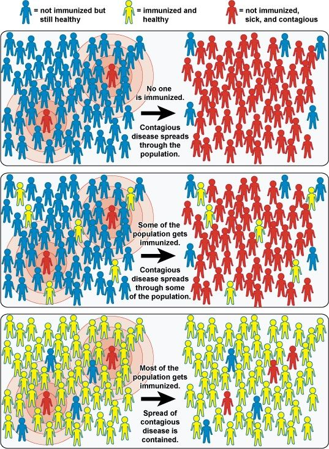
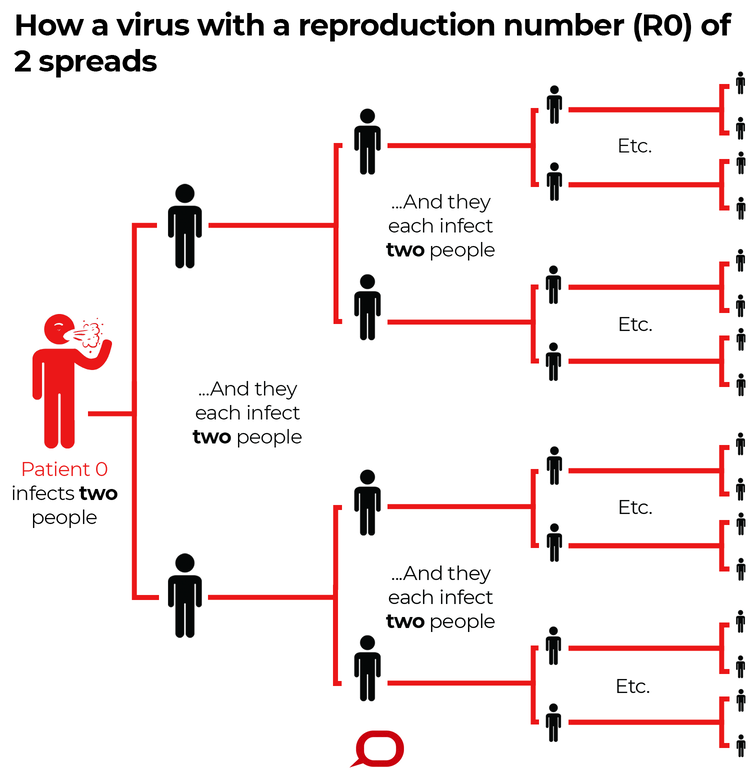

މި އަހަރުގެ ކުރީކޮޅު ޗައިނާގެ ވުހާންއިން ފެނުނު ކޮރޯނާވައިރަސް މިހާރު މިވަނީ ދުނިޔޭގެ އެތަށް މިތަނަށް ފެތުރި ފައެވެ. ދުނިޔޭގެ އެތައް ގައުމަކަށް މި ބަލާއާފާތާއި ކުރިމަތިވެ، މިކަމުން އަރައިގަތުމަށް އެކި ކަހަލަ ފިޔަވަޅުތައް ދަނީ އަޅަމުންނެވެ. އެގޮތުން ގައިދުރުކަމުގެ ފިޔަވަޅުތަކާއި، ބަލި ޖެހިފައި ތިބޭ މީހުންނާއި އެމީހުންނާ ކޮންޓެކްޓްވި މީހުން އެކަހެރި ކުރުމާއި، ލޮކްޑައުން ކުރުން ފަދަ ފިޔަވަޅުތައް ދަނީ އަޅަމުންނެވެ. ރާއްޖެއަށް ވެސް މި ބަލާއާފާތް ކުރިމަތިވެ، މިހާރު މިވަނީ މުޅި މާލެ ލޮކްޑައުން ކޮށްފައެވެ.

މި ލިިޔުމުގައި އަޅުގަނޑު ބަލާލަން ގަސްތުކުރަނީ "ހާރޑް އިމިޔުނިޓީ"ގެ މަފްހޫމުގެ މައްޗަށްށެވެ. ހާރޑް އިމިޔުނިޓީ އަކީ ކޮބައިކަމާއި، ކޮވިޑް-19ގެ ބަލާއާފާތުން ސަލާމަތް ވުމުގައި ހާރޑް އިމިޔުނިޓީ ކުޅޭ ރޯލުގެ މައްޗަށެވެ.

## ހާރޑް އިމިޔުނިޓީ އަކީ ކޮބާ؟

އެންމެ ފުރަތަަމަ ބައްޔަަކަށް އިމިޔުން ވުމަކީ ކޮބައިކަމާއި މައިގަނޑު ގޮތެއްގައި ބައްޔަކުން އިމިޔުން ވެވޭނެ ގޮތްތަކަކީ ކޮބައިތޯ ބަލާލަމާ ހެއްޔެވެ.

އަލަށް ބައްޔެއް ޖެހުމުން އެބަލިން ދިފާއުވުމަށް އިންސާނާގެ ދިފާއީ ނިޒާމު "އެންޓި ބޮޑީސް" އޭ ކިޔާ މާއްދާއެެއް އުފައްދައެވެ. ބަލިން ރަނގަޅުވުމަށް ފަހުވެސް ވަކި ދުވަސްތަކެއް ވާންދެން މި އެންޓި ބޮޑީސް އިންސާނާގެ ހަށިގަނޑުގައި ހުރެެއެވެ. މި އެންޓި ބޮޑީސް ހުންނަ މުއްދަތު އެކި ބަލީގެ ބާވަތުން ތަފާތުވެއެވެ. ބައެއް ފަހަރު ދުވަސްތަކަަކަށް، ނުވަތަ މަސްތަކަކަށް، ނުވަތަ އަހަރުތަކަކަށް ވެސް ދެމިގެން ދެއެއެވެ. އަލަށް ބައްޔެއް ޖެހި، އެ ބަލިން ރަނގަޅުވެ، ހަށިގަނޑުގައި އެެންޓި ބޮޑީސް ހުރުމުގެ ސަބަބުން ދެވަނަ ފަހަރަށް އެ ބަލި ނުޖެހި އެ ބައްޔަކުން "އިމިޔުން"ވެ، ރައްކާތެރިކަން ލިބެއެވެ. މިއީ ގުދުރަތީގޮތުން ބައްޔަކުން އިމިޔުންވާ ގޮތެވެ.

ބަލިން އިމިޔުން ވެވޭ ދެވަނަ ގޮތަކީ ވެކްސިނެވެ. އެއީ މަސްނުޢީކޮށް ވެވޭ އިމިޔުން އެކެވެ. ވެކްސިން ޖެހުމުގެ ސަބަބުން ތިމާއަށް ބަލި ޖެހިފައި ނުވި ކަމުގައިވިޔަސް، ބަލިން އިމިޔުންވެ ރައްކާތެރިކަން ލިބެއެވެ.

ބައްޔަކުން "އިމިޔުން" ވުމަކީ މިދެންނެވި ގޮތަށް – ބައްޔެއް ޖެހި އެ ބަލިން ރަނގަޅުވުމުގެ ސަބަބުން ނުވަތަ ވެކްސިން ޖެހުމުގެ ސަބަބުން – ބަލި ދެވަނަ ފަހަރަށް ނުޖެހި ފުރިހަމަ ރައްކާތެރިކަން ލިބުމެވެ.

"ހާރޑް އިމިޔުނިޓީ" އަކީ އެޕިޑީމިޔަލޮޖީ ޢިލްމުގައި ހިމެނޭ މަފްހޫމުކެވެ. އާންމު ގޮތެއްގައި މީގެ މާނައަކީ އާބާދީގެ ބޮޑު ބައެއް ބައްޔަކަށް އިމިޔުން ވެފައިވުމުގެ ސަބަބުން އެ ބަލި ދެން ތިބި (އިމިޔުން ނުވާ) މީހުނަށް ނުޖެހި، ކޮންޓުރޯލް ވުމެވެ. މިއީ ކުރިން ދެންނެވި ދެ ގޮތުން – ގުދުރަތީ ގޮތުން ނުވަތަ ވެކްސިން ޖަހައިގެން – ކުރެ ގޮތަކުން އާބާދީގެ ބޮޑު ބައެއް ބައްޔަކަށް އިމިޔުންވެ، ފުރިހަމަ ރައްކާތެރިކަން ލިބުމެވެ.

<figure class="kg-card kg-image-card kg-card-hascaption">

<figcaption>Illustration Source: National Institute of Allergy and Infectious Diseases (NIAID), [Public Domain](https://creativecommons.org/publicdomain/mark/1.0/deed.en)</figcaption>

</figure>

އާބާދީގެ ބޮޑު އިންސަތައެއް ވެކްސިން ޖަހައިގެން ނުވަތަ އެނޫންވެސް ގޮތަކުން ބައްޔަކަށް އިމިޔުން ވާނަމަ، ދެން ތިބޭ ބަޔަކަށް އެ ބަލި ނުޖެހި ބަލި މުޅިން ކޮންޓްރޯލް ކުރެވެއެވެ. މިސާލަކަށް، މުޖުތަމައުގައި އެކި ކަހަލަ ސިއްހީ ސަބަބުތަކަށްޓަކައި ވެކްސިން ނުދެވޭ ފަރާތްތަކާއި ވެކްސިން ޖެހުމާ ދެކޮޅުހަދާ މަދު ފަރާތްތަކަށް، ބަލި ނުޖެހި ރައްކާތެރިކަން ލިބެނީ މިދެންނެވި ހާރޑް އިމިޔުނިޓީގެ ސަބަބުން އާބާދީގެ ބޮޑު ބައެއް ބައްޔަށް އިމިޔުން ވެފައިވާތީއެވެ.

ބައްޔަކުން ހާޑް އިމިޔުނިޓީ ހޯދައިގަތުމަށް އެ ތަނެއްގައި ދިރިއުޅޭ މީހުންގެ ތެރެއިން އެ ބައްޔަކަށް އިމިޔުން ވާންޖެހޭ މީހުންގެ އަދަދު (ނުވަތަ ނިސްބަތް) އެކި ބަލީގައި ތަފާތެވެ. މި ނިސްބަތަށް ކިޔައި އުޅޭ ނަމަކީ "ހާރޑް އިމިޔުނިޓީ ތުރެޝްހޯލެޑް" އެވެ. މި ތަފާތު އަންނަ މައިގަނޑު ސަބަބަކީ އެކި ބަލިތަށް ފެތުރޭ ހަލުވިމިނާއި ލަސްމިން ތަފާތުވުމެވެ.

މިސާލަކަށް، ހިމަ ބިއްސަކީ ވަރަށް ހަލުވި ކަމާއެކު ފެތުރޭ ބައްޔެކެވެ. މި ބަލި ޖެހިފައިވާ ކޮންމެ މީހެއްގެ ފަރާތުން އެވްރެޖްކޮށް، އިތުރު 12 މީހަކަށް މި ބަލި ޖެހޭ ކަމަށް ވެއެވެ. މި ގޮތަށް، ބަލި ޖެހިފައިވާ ކޮންމެ މީހެއްގެ ފަރާތުން އެވްރެޖްކޮށް އިތުރަށް ބަލި ޖެހޭ މީހުންގެ އަދަދަށް ކިޔަނީ ["ބޭސިކް ރިޕްރޮޑަކްޓިވް ރޭ](https://wwwnc.cdc.gov/eid/article/25/1/17-1901_article)ޓް[" ނުވަތަ R0 (އާރް-ނައުޓް)](https://wwwnc.cdc.gov/eid/article/25/1/17-1901_article) އެވެ. އެހެން ގޮތަކަށް ބުނާނަމަ، R0 (އާރް-ނައުޓް) އެކީ އެކަކު އެނެކަކު ގައިން ބަލިފެތުރޭ މިންވަރެއެވެ.

ހިމަ ބިހީގެ "ބޭސިކް ރިޕްރޮޑަކްޓިވް ރޭޓް" އަކީ 12 ކަމުގައި ބަލާނަމަ، އޭގެ މާނައަކީ ހިމަ ބިހިން ހާރޑް އިމިޔުނިޓީ ހޯދާގަތުމަށް އާބާދީގެ ގާތްގަނޑަކަށް 94.5% މީހުން އިމިޔުން ވާންޖެހޭނެއެވެ.

ކޮރޯނާވައިރަސް ފެތުރޭ އަވަސް ލަސްމިނަށް ބަލާއިރު، މި ވައިރަސްގެ "ބޭސިކް ރިޕްރޮޑަކްޓިވް ރޭޓް" ނުވަތަ R0 (އާރު-ނައުޓް) އަދަދު ހުރީ 2 އަކާއި 2.5 އަކާއި ދެމެދު ކަމަށް [ޑަބްލިއު އެޗްއޯ](https://www.who.int/docs/default-source/coronaviruse/who-china-joint-mission-on-covid-19-final-report.pdf) އިން ވަނީ އަންދާޒާކޮށްފައެވެ. މިއީ ޗައިނާގައި ބަލި ފެތުރިފައިވާ ގޮތަށް ބަލައި އަންދާޒާ ކޮށްފައިވާ އަދަދެކެވެ. މީގެ އިތުރުން ލަންޑަންގެ އިމްޕީރިއަލް ކޮލެޖުން [ނެރުނު ރިޕޯޓް](https://www.imperial.ac.uk/mrc-global-infectious-disease-analysis/covid-19/report-3-transmissibility-of-covid-19/) ގައި, ކޮރޯނާ ވައިރަހުގެ R0 (އަރު-ނައުޓް) އަދަދު ލަފާކޮށްފައިވަނީ 1.5 އަކާއި 3.5 އަކާއި ދެމެދެއެވެ.

ކޮރޯނާވައިރަހުގެ R0 (އާރު-ނައުޓް) އަދަދަކީ 2.5 ކަމަށް ބަލައިފިނަމަ، މި ވައިރަހުން ހާރޑް އިމިޔުނިޓީ ހޯދާގަތުމަށް އާބާދީގެ 60% މީހުން އިމިޔުން ވާން ޖެހޭނެއެވެ. ޖޯން ހޮޕްސްކިން ޔުނިވާސިޓީއިން [ލަފާކުރާ ގޮތުގައި](https://www.jhsph.edu/covid-19/articles/achieving-herd-immunity-with-covid19.html) އާބާދީގެ 70% މީހުން އިމިޔުން ވާންޖެހޭނެއެވެ.

ރާއްޖޭގެ ތަފާސްހިސާބުން ބަލާނަމަ ގާތްގަނޑަކަށް 334،456 މީހުން މި ބަލިން އިމިޔުން ވާން ޖެހޭނެއެވެ. އެއީ ރާއްޖޭގެ އާބާދީ ހުންނާނެކަމަށް ލަފާކުރާ ޖުމުލަ އަދަދަކީ 557،426 ކަމަށް ބަލައި، އޭގެ 60% އެވެ. 70% އިން ބަލާނަމަ ގާތްގަނޑަކަށް 390،198 މީހުނެވެ.

<figure class="kg-card kg-image-card kg-card-hascaption">

<figcaption>Source: The Conversation, [CC BY-ND](http://creativecommons.org/licenses/by-nd/4.0/)</figcaption>

</figure>

ކޮންމެއަކަސް "ބޭސިކް ރިޕްރޮޑަކްޓިވް ރޭޓް" ނުވަތަ R0 (އާރު-ނައުޓް) އަކީ ހުރިހާ ގައުމެއްގައި ނުވަތަ ތަނެއްގައި އެއްވަރަކަށް ހުންނަ އަދަދެއް ނޫނެވެ. އެ ތަނެއްގެ [ހަލާތުން މި އަދަދު ތަފާތުވެގެން](https://theconversation.com/r0-how-scientists-quantify-the-intensity-of-an-outbreak-like-coronavirus-and-predict-the-pandemics-spread-130777) ދެއެވެ. R0 (އާރު-ނައުޓް) އަކީ ތަނެއްގައި ބަލި ފެތުރެން ފަށާއިރު، އެ ބަލިން އެއްވެސް މީހަކު އިމިޔުން ނުވާ ހާލަތުގައި، ބަލި ފެތުރިގެންދާނެ މިންވަރެއެވެ.

ބައްޔެއް ފެތުރޭނަމަ ބަލިން ރައްކާތެރި ވުމުގެ ގޮތުން ކޮންމެވެސް ކަހަލަ ފިޔަވަޅުތަކެއް އަޅާނެއެވެ. އަދި ބަލި ފެތުރެން ފެށުމުން ބަލިން ރަނގަޅުވެ ބައެއް މީހުން ބައްޔަށް އިމިޔުންވެސް ވާނެއެވެ. މިފަދަ ބަދަލު ތަކާއެކު، ބަލި ފުތެރޭ އަދަދަށް ކިޔައި އުޅެނީ "އެފެއްކްޓިވް ރިޕްރޮޑަކްޓިވް ރޭޓް (R)" އެވެ. މި އަދަދަކީ އެ ތަނެއްގެ ހާލަތު އެއިރެއްގައި ހުރި ގޮތަށް ބަލައި ބަދަލުވަމުންދާ އަދަދެކެވެ.

"ބޭސިކް ރިޕްރޮޑަކްޓިވް ރޭޓް" އާއި "އެފެކްޓިވް ރިޕުރޮޑަކްޓިވް ރޭޓް" އަކީވެސް، އެކި ގައުމުތަކާއި ތަންތަނުގައި ތަފާތު އެއްޗެކެވެ. މީގެ ތެރެއިން "އެފެކްޓިވް ރިޕުރޮޑަކްޓިވް ރޭޓް (R)" އަކީ ބަލި ކޮންޓުރޯލް ކުރުމުގައި ވަރަށް މުހިއްމު ރޯލެއް ކުޅޭ އެއްޗެކެވެ. މި ލިޔުމުގެ ތަންކޮޅެއް ފަހުން މިކަމަށް ބަލާލާނަމެވެ.

## ކޮވިޑްއިން އިމިޔުނިޓީ ލިބޭތަ؟

ކޮރޯނާ ވައިރަހަކީ އައު ވައިރަހެއް ކަމުން މި ވައިރަހާ ގުޅޭ ދިރާސާތައް އަދި ދަނީ ކުރިއަށެވެ. އެހެންކަމުން، މި ވައިރަހުން އިމިޔުން ވާނަމަ އިމިޔުން ވަނީ ކިހާ މުއްދަތަކަށް ކަމެއް އަދި ވަނީ ނޭނގުމެއްގެ ތެރޭގައެވެ.

ދުނިޔޭގެ ސިއްހަތު ޖަމިއްޔާއިން ވަނީ، ކޮވިޑް ޖެހި ރަނގަޅުވި ކަމުގައިވިޔަސް ބަލިން ފުރިހަމައަށް އިމިޔުންވީ ކަމަށް އަދި ބުނަން ނޭނގޭ ކަމަށް ބުނެ، ޓުވީޓެއް ކޮށްފައެވެ. ބައެއް ފަރާތްތަކަށް މީގެ މާނަ އޮޅި، ކޮރޯނާ ވައިރަހުން އެއްވެސް ވަރަކަށް އިމިޔުން ނުވާކަމަށް ޑަބްލިޔު އެޗް އޯއިން ބުނާކަމަަށް ރިޕޯޓު ކުރިއެވެ.

އާއްމު އުސޫލުން ބަލާއިރު، ބައްޔެއް ޖެހި އެ ބައްޔަކުން ރަނގަޅުވުމުން ހަށިގަނޑުގައި ކޮންމެވެސް ވަރަކަށް އިމިޔުނިޓީ އުފެދޭނެއެވެ. މިގޮތަށް އެއްވެސް ވަރަކަށް ގުދުރަތީ ގޮތުން އިމިޔުނިޓީ ނުއުފެދޭ ކަމުގައިވާނަމަ އެއީ ވަރަށް ވެސް ބިރުހުރި ކަމަކަށް ވާނެކަން ޔަގީނެއެވެ. ނަމަވެސް މިއީ އަދި ފެންނަ ފެނުމުގައްޔާއި ކުރިން ކުރެވިފައިވާ ދިރާސާތަކަށް ބަލައި، ވުން އެކަށޭނެ ގޮތެއް ކަމަކަށް އަދި ނުފެނެއެވެ. ޑަބްލިޔު އެޗް އޯއިން ފަހުން ވަނީ މިކަން ސާފު ކޮށްދީފައެވެ.

<figure class="kg-card kg-embed-card">

<iframe id="twitter-widget-0" scrolling="no" frameborder="0" allowtransparency="true" allowfullscreen="true" class="" style="position: static; visibility: visible; width: 550px; height: 1014px; display: block; flex-grow: 1;" title="Twitter Tweet" src="https://platform.twitter.com/embed/Tweet.html?creatorScreenName=adhuhamism&amp;dnt=false&amp;embedId=twitter-widget-0&amp;features=eyJ0ZndfZXhwZXJpbWVudHNfY29va2llX2V4cGlyYXRpb24iOnsiYnVja2V0IjoxMjA5NjAwLCJ2ZXJzaW9uIjpudWxsfSwidGZ3X2hvcml6b25fdHdlZXRfZW1iZWRfOTU1NSI6eyJidWNrZXQiOiJodGUiLCJ2ZXJzaW9uIjpudWxsfSwidGZ3X3NwYWNlX2NhcmQiOnsiYnVja2V0Ijoib2ZmIiwidmVyc2lvbiI6bnVsbH19&amp;frame=false&amp;hideCard=false&amp;hideThread=false&amp;id=1254160940020498435&amp;lang=en&amp;origin=http%3A%2F%2Flocalhost%3A2369%2Fblog%2F2020%2F05%2Fcovid19-and-herd-immunity-with-a-glance-at-sweden%2F&amp;sessionId=46f19d65ac8fbedaf696dca07ac6fe37e585f663&amp;siteScreenName=adhuhamism&amp;theme=light&amp;widgetsVersion=75b3351%3A1642573356397&amp;width=550px" data-tweet-id="1254160940020498435"></iframe>

</figure>

ކޮވިޑް ޖެހި ރަނގަޅުވުމުން ކޮންމެވެސް ވަރެއްގެ އިމިޔުނިޓީއެއް ހަށިގަނޑުގައި އުފެދޭނެއެވެ. ނަމަވެސް މި އިމިޔުނިޓީގެ ވަރުގަދަ މިނާއި، މި އިމިޔުނިޓީ ހުންނާނީ ކިހާ މުއްދަތެއް ވާންދެން ކަމެއް އަދި ނޭނގެއެވެ.

މި ދިޔަ އެޕްރީލް މަހުގެ ކުރީކޮޅު ސައުތު ކޮރެއާއިން ކޮވިޑް ޖެހި ރަނގަޅުވި ބައެއް މީހުނަށް ދެވަނަ ފަހަރަށް ބަލި ޖެހުނު ކަމަށް ރިޕޯޓު ކުރިއެވެ. ސައުތު ކޮރެއާގެ [ދިރާސާކުރާ ފަރާތްތަކުން ބޮޑަށް ބުރަވާ](https://en.yna.co.kr/view/AEN20200429007051320) ގޮތުގައި މިގޮތަށް ދިމާވަނީ ޓެސްޓް ކުރުމުގައި ދިމާވާ މައްސަލަތަކެއްގެ ސަބަބުންނެވެ. އަދި މިގޮތަށް ޕޮޒިޓިވް ކަމަށް ދައްކަނީ ބަލިން ރަނގަޅުވުމަށް ފަހުވެސް ބަލި ޖެއްސުމުގެ ބާރު ނެތް، ވައިރަހުގެ އެތި ކޮށްކޮޅު ހަށިގަނޑުގައި ހުންނާތީއެވެ.

## އެންޓި ބޮޑީ ޓެސްޓް ކުރުމާއި ބަލި ޖެހުނު މީހުންގެ އަސްލު އަދަދު ހޯދުން

ތަނެއްގައި ބައްޔަކުން މީހުން އިމިޔުން ވެފައިވަނީ ކިހާވަރަކަށްތޯ ބަލައި ލަފާކުރުމަށް އެންމެ މުހިއްމު ރޯލެއް ކުޅޭ އެއްޗަކީ އެންޓި ބޮޑީ ޓެސްޓިންނެވެ. މި ޓެސްޓް ހަދަނީ އާބާދީގެ ތެރެއިން ސާމްޕަލްތަކެއް ނަގައި އެ ސާމްޕަލް ތަކުގައި "އެންޓި ބޮޑީސް" ހުރިތޯ ބަލައިގެންނެވެ. އެންޓި ބޮޑީސް ހުރިކަމަށް ޓެސްޓުތަކުން ދައްކާނަމަ، އޭގެ މާނައަކީ އެމީހަކު އެ ބައްޔަށް އިމިޔުން ވެފައިވުމެވެ.

[ދިރާސާތަކުން ދައްކާ ގޮތުގައި](https://www.medrxiv.org/content/10.1101/2020.02.03.20020248v2) ބައެއް މީހުންނަށް ކޮވިޑް-19 ޖެހި އެއްވެސް ވަރަކަށް އަލާމާތެއް ނުފެނި ނުވަތަ ވަރަށް ކުޑަކޮށް އަލާމާތްތައް ފެނި ރަނގަޅުވެގެން ދެއެވެ. މިހެން ވުމުގެ ސަބަބުން ގިނަ ފަހަރަށް މި ފަރާތްތަކަށް ބަލި ޖެހިފައިވާ ކަމެއް ނޭނގެއެވެ. މިގޮތަށް މުޖުތަމައުގައި ވަރަށް ގިނަ ފާރާތްތަކެއް ތިބުން އެކަށީގެން ވެއެވެ. އެފަދަ ފަރާތްތަކަށް ކިޔަނީ "އެސިންމްޕްޓޮމެޓިކް ކެރިއާސް" އެެވެ.

ކޮވިޑް-19 ޖެހިފައިވާ މީހުންގެ އަދަދުގެ ގޮތުގައި ރަސްމީ އިދާރާތަކުން އެކުލަވައިލާ ލިސްޓުތަކުގައި، މުޖުތަމައުގައި ތިބޭ މިފަދަ މީހުން ގިނަ ފަހަރަކު ނުހިމެނެއެވެ. ރަސްމީ ތަފާސްހިސާބުގައި އާންމުގޮތެއްގައި ހިމެނެނެނީ ކޮންމެވެސް ކަހަލަ އަލާމާތްތަކެއް ފެނިފައިވާ މީހުންނެވެ. އެއީ، ގިނަފަހަރަށް މިކަހަލަ "އެސިންމްޕްޓޮމެޓިކް ކެރިއާސް" ހޯދައިގަންނަން އުނދަގޫ ވާތީއެވެ. އަދި ހުދު އެފަރާތްތަކަށްވެސް ބަލި ޖެހުނުކަން ނޭނގޭތީއެވެ.

އެހެންކަމުން، އަލާމާތެއް ނުފެނި ކޮވިޑް ޖެހޭ މީހުން މުޖުތަމުގައި ތިބޭނެ ކަމަށް ބެލުމުން، ބަލި ޖެހުނު މީހުންގެ އަަސްލު އަދަދު ރަސްމީ އަދަދަށް ވުރެ އިތުރު ވާނެއެވެ. މި އަދަދު ހޯދައިގަތުމަށް މުޖުތަމުގައި "އެންޓި ބޮޑީ ޓެސްޓް" ތަކެއް ހެދުން ވަރަށް މުހިއްމެއެވެ. މިކަމަކީ އެތަނެއްގެ ބަލީގެ ހާލަތު ދެނެގަތުމަށާއި މިހާރު ބައްޔަށް އިމިޔުންވެފައި ހުރިވަރު، ސައްހަ ކަމާއެކު ހޯދާގަތުމަށް މުހިއްމު ކަމެކެވެ.

މިގޮތަށް އެމެރިކާގެ [ސެންޓަރ ކްލަރާ ގައި ކުރި ދިރާސާއަކުން](https://www.nature.com/articles/d41586-020-01095-0) ދެއްކި ގޮތުގައި، ކޮންމެ 66 މީހަކުން 1 ކަށް ކޮވިޑް ޖެހިފައި ވެއެވެ. މި ދިރާސާ ބުނާގޮތުން، އެ ތަނުގައި ބަލިޖެހިފައިވާ މީހުންގެ އަސްލު އަދަދު ހުންނާނީ 23،000 ގައެވެ. މި ދިރާސާ ކުރިއިރު، ސެންޓަރ ކްލަރާ އިން ރަސްމީކޮށް ރިޕޯޓް ކޮށްފައިވަނީ ގާތްގަނޑަކަށް 1000 ކޭސްއެވެ. އެހެންކަމުން، ބަލި ޖެހުނު މީހުންގެ އަދަދު ރަސްމީ ހިސާބުކުރުންތަކަށް ވުރެއް އެތައް ގުނައެއް އިތުރު ވާނެކަމަށް މިދިރާސާއިން ދައްކައެވެ. ނަމަވެސް ބައެއް ސައިންޓިސްޓުން މިފަދަ ދިރާސާތަކުގައި ބޭނުންކުރާ ޓެސްޓް ކިޓް ތަކުގެ ސައްހަ ކަމާއިމެދު ސުވާލު އުފައްދާފައި ވެއެވެ.

މިފަހުން [އެމެރިކާގެ ނިއުޔޯރކް ސްޓޭޓްގައ](https://www.governor.ny.gov/news/amid-ongoing-covid-19-pandemic-governor-cuomo-announces-results-completed-antibody-testing)ި ވެސް ވަނީ މިކަހަލަ "އެންޓި ބޮޑީ ޓެސްޓް" ތަކެއް ހަދާފައެވެ. މި ޓެސްޓްތަކުން ދެއްކި ގޮތުން އެތަނުގެ އާބާދީގެ 12.3% މީހުންނަށް ބަލި ޖެހިފައި ވެއެވެ.

ރާއްޖޭގައިވެސް މިގޮތަށް އެންޓި ބޮޑީ ޓެސްޓް ތަކެއް ހެދުން ވަރަށް ބުއްދި ވެރިއެވެ. ބަލީގެ އަސްލު ހާލަތް ދެނެގަނެ، ބަލި ޖެހިފައިވާ މީހުންގެ އަސްލު އަދަދު ހޯދާ ގަތުމަށް މިފަދަ ޓެސްޓް ތަކެއް ހެދުން މުހިއްމެވެ.

## ބަލި ކޮންޓުރޯލް ކުރެވޭ ދެ ގޮތް

ބަލި ފެތުރުން ކޮންޓްރޯލް ކުރުމުގައި ކުރިން ދެންނެވި "އެފެއްކްޓިވް ރިޕްރޮޑަކްޓިވް ރޭޓް (R)" އަކީ ވަރަށް މުހިއްމު ރޯލެއް ކުޅޭ އެއްޗެކެވެ. މިއީ ތަނެއްގައި ބަލި ޖެހޭ ކޮންމެ މީހެއްގެ ފަރާތުން އެވްރެޖްކޮށް އިތުރަށް ބަލިޖެހޭ މީހުންގެ އަދަދެވެ. މި އަދަދު ރަމްޒު ކޮށްދެނީ ތަނެއްގައި ބަލި ފެތުރެމުންދާ މިނެއެވެ. އެހެންކަމުން، ބަލި ކޮންޓުރޯލްވިކަން ދެނެގަތުމަށް އެތަނެއްގެ "އެފެއްކްޓިވް ރިޕްރޮޑަކްޓިވް ރޭޓް (R)" ދެނެގަތުން މުހިއްމެއެވެ. ތަނެއްގައި ބަލި ކޮންޓުރޯލު ކުރުމަށް އަޅާ އެކިކަހަލަ ފިޔަވަޅު ތަކުގެ ސަބަބުން މި އަދަދަށް ބަދަލު އާދެއެވެ. މިސާލަކަށް، ގައިދުރުކަމުގެ ފިޔަވަޅުތައް އެޅުމުގެ ސަބަބުން ބަލި ފެތުރޭ މިންވަރު ދައްވުމުން މި އަދަދު ދައްވެއެވެ. މިހެން ދައްވަމުން ގޮސް 1 ކަށް ވުރެއް ދައްވުމުން ބަލި ކޮންޓުރޯލްވީ ކަމުގައި ބުނެވެއެވެ.

ކޮވިޑް ފަަދަ ބަލިތައް [ކޮންޓުރޯލް ކުރުމަށް ދެ ގޮތެއް](https://www.imperial.ac.uk/mrc-global-infectious-disease-analysis/covid-19/report-9-impact-of-npis-on-covid-19/) ވެއެވެ. އެއީ، (1) ސަޕްރެޝަަން އާއި (2) މިޓިގޭޝަން އެވެ.

ސަޕްރެޝަން އަކީ ބަލި ކޮންޓުރޯލް ކުރުމަށް އެކިކަހަލަ ވަރުގަދަ ފިޔަވަޅުތައް އަޅައި، ބަލި ފެތުރޭ މިންވަރު އެއްކޮށް ހުއްޓުމަކަށް ގެނައުމެވެ. ނުވަތަ "އެފެއްކްޓިވް ރިޕްރޮޑަކްޓިވް ރޭޓް (R)" އެކަކަށް ވުރެއް ދައްކޮށްލުމެވެ. މިކަން ކުރެވެނީ އިޖްތިމާއީ ގައިދުރުކަމާއި، ހޯމް އައިސޯލޭޝަނާއި، ކޭސް އައިސޮލޭޝަނާއި، ހޯމް ކަރަންޓީނާއި، އަދި މުޅިން ލޮކްޑައުން ކުރުންފަދަ ހަރުކަށި ފިޔަވަޅުތައް އަޅައިގެންނެވެ. ބައްޔެއް ސަޕްރެސް ކުރުމަށް އެ ބައްޔެއް މުޅިން މުޖުތަމައަށް ފެތުރުމުގެ ކުރިން ކުރީބައިގައި، މި ދެންނެވި ފިޔަވަޅުތައް އެޅުން މުހިންމެއެވެ. ސައުތު ކޮރެއާ ފަދަ ގައުމުތަކުން ގެންގުޅުނު އުސޫލަކީ މިއެވެ. ޓެސްޓުކުރުން އިތުރުކޮށް، ޓެކްނޮލެޖީގެ އެހީއާއެކު އަވަހަށް ކޮންޓެކްޓް ޓްރޭސިން ހަދައި، ހޭލުންތެރި މުޖުތުމައެއްގެ އެހީގައި އެ ގައުމު ވަނީ ބަލި ކޮންޓުރޯލް ކުރުމުގައި ބޮޑު ކާމިޔާބީއެއް ހޯދާފައެވެ.

ދެން އޮތީ މިޓިގޭޝަން އެވެ. ބައްޔެއް މިޓިގޭޓް ކުރުމަކީ އިޖްތިމާއި ގައިދުރުކުމާއި، ހޯމް އައިސޯލޭޝަނާއި، ކޭސް އައިސޮލޭޝަނާއި، ހޯމް ކަރަންޓީނު ފަދަ ފިޔަވަޅުތައް އަޅައި، ބަލި ފެތުރުން މުޅިން ހުއްޓުވާލުމުގެ ބަދަލުގައި ބަލި ޖެހޭ މިންވަރު ކޮންޓުރޯލްކޮށް އެއްވަރަކަށް ހިފެހެއްޓުމެވެ. މީގެ މާނައަކީ އެކި ކަހަލަ ފިޔަވަޅުތައް އަޅައި، ބަލި ޖެހޭ މިންވަރު އެތަނެއްގެ ސިއްހީ ނިޒާމު ކޭޓާރ ކުރާ ވަރަށް އަބަދުވެސް ހިފެހެއްޓުމެވެ.

ބައްޔެއް ސަޕްރެސް ކުރާނަމަ، އެ ބަލިން ރައްކާތެރިވުމަށް އަޅާ ލޮކްޑައުން އާއި ގައިދުރުކަމުގެ ފިޔަވަޅުތައް ގިނަ ދުވަސްތަކެއް ވާންދެން ދަމަހައްޓަން ޖެހެއެވެ. އަދި މި ފަދަ ފިޔަވަޅުތައް އުވާލައިފި ނަމަ ނުނީ ލުޔެއް ދީފިނަމަ، ދެވަނަ ފަހަރަށް ބަލި ފެތުރި ބަލީގެ ދެވަނަ ރާޅެއް އައުން ގާތެވެ. މިގޮތަށް ދެވަނަ ފަހަރަށް ބަލި ފެތުރިގަންނަ އިރު، ފުދޭ ވަރަކަށް ވަރުގަދައަށް ފެތުރި ގަތުން އެކަށީގެންވެއެވެ. އެއީ މި އުސުލޫގެ ސަބަބުން ފުރަތަމަ ރާޅުގައި ބަލި ޖެހި، ބަލިން އިމިޔުންވެފައިވާ މީިހުން މަދުވާނެތީއެވެ.

މިޓިގޭޝަން އުސޫލެއްގައި ލިބޭނެ އެންމެ ބޮޑު ފައިދާއަކީ ގިނަ ބަޔަކަށް ބަލި ޖެހި، ބަލިން ރަނގަޅުވެ، ބަލިން އިމިޔުންވާން ފުރުސަތު ލިބުމެވެ. ނަމަވެސް މިޓިގޭޝަނެއްގައި ބަލީގެ ސަބަބުން މީހުން މަރުވާ ނިސްބަތް ބޮޑު ވާނެއެވެ. އެއީ މި އުސޫލުގައި ބަލި ފެތުރިގަންނަ މިންވަރު އިތުރުވާނެ ތީއެެވެ. އަދި އުމުރުން ދުވަސްވީ މީހުން ފަދަ ހައި ރިސްކް މީހުންނަށް މި ބަލި ޖެހުމުގެ ފުރުސަތު ބޮޑުވާނެ ތީއެވެ. މިއުސޫލުގައި ގިނަ ދުވަސްތަކެއް ވާންދެން ސިއްހީ ނިޒާމު އޮންނާނީ ބާރު ބޮޑުވެފައެވެ. އަދި ބަލި ކޮންޓުރޯލުން ނައްޓައި، ސިއްހީ ނިޒާމު ބޮއްސުންލައިގެ ދިޔުމުގެ ފުރުސަތުވެސް އޮންނާނެއެވެ.

ސަޕްރެޝަނެއްގައި، ފުރިހަމަ ކަމާއެކު ފިޔަވަޅުތައް އެޅިއްޖެނަމަ، ބަލީގެ ސަބަބުން މީހުން މަރުވާ ނިސްބަތް ކުޑަވާނެ ކަމަށް ދިރާސާތަކުން ދައްކައެވެ. ލަންޑަންގެ [އިމްޕީރިއަލް ކޮލެޖުން ނެރުނު ރިޕޯޓެއްގައި](https://www.imperial.ac.uk/mrc-global-infectious-disease-analysis/covid-19/report-12-global-impact-covid-19/) ލަފާ ކޮށްފައިވާ ގޮތުން، މިޓިގޭޝަން އުސޫލެއްގަައި 20 މިލިއަން ފުރާނަ ސަލަމާތް ކުރެވިދާނެއެވެ. ނަމަވެސް ކުރީބައިގައި އެޅޭ ސަޕްރެޝަން އުސޫލެއްގައި 38.7 މިލިއަން ފުރާނަ ސަލާމަތް ކުރެވިދާނެއެވެ. އަދި ބަލި ފެތުރެން ފަށައި، މީހުން މަރުވާ އަދަދު އިތުރުވާ ފަހުން އެޅި ކަމުގައި ވިނަމަވެސް 30.7 މިލައަން ފުރާނަ، ސަޕްރެޝަން އުސޫލެއްގައި ސަލާމަތް ކުރެވިދާނެ އެވެ.

ކޮންމެއަކަސް، ބަލި ކޮންޓުރޯލް ކުރުމަށް ގެންގުޅޭނެ ޕޮލިސީ އާއި އަޅާނެ ފިޔަވަޅުތައް ނިންމަން ޖެހޭނީ އެ ތަނެއްގެ ހާލަތާއި، އިސްކަންދޭ ކަންތައްތަކަށް ރިއާޔަތް ކޮށެވެ. ސަޕްރެޝަން އުސޫލެއްނަމަ ގިނަ ދުވަސް ތަކެއް ވާންދެން ބޮޑެތި ފިޔަވަޅު ތަކެއް އަޅަން ޖެހޭނެއެވެ. މިކަމުގެ ސަބަބުން އިގްތިސޯދަށް ވަރަށް ބޮޑު ނޭދެވޭ އަސަރުކުރުން އެކަށީގެންވެއެވެ. އަދި ހާއްސަކޮށް ކުދި ގައުމުތަކަށް މީގެ ސަބަބުން ގެއްލުން ކުރާލެއް ބޮޑުވާނެ އެވެ.

މިޓިގޭޝަން އުސޫލުކަށް ދާ ކަމުގައި ވާނަމަ، ބަލީގެ ސަބަބުން މަރުވާ މީހުންގެ އަދަދު އިތުރުވުން އަކަށީގެން ވެއެވެ. އަދި ސިއްހީ ނިޒާމަށް ކުރާ ބާރު ބޮޑުވެ، ސިއްހީ ނިޒާމު ބޮއްސުންލައިގެން ދިޔުން އެކަށީގެންވެއެވެ. ހާއްސަކޮށް، ކުދި ގަައުމުތަކުގައި ސިއްހީ ނިޒާމަށް ކުރާ ބާރު ބޮޑުވެ، ކޭޓަރ ނުވާވަރަށް ބަލި ފެތުރުމުގެ ފުރުސަތު ބޮޑު ކަމުގައި އިމްޕީރިއަލް ކޮލެޖުގެ ރިޕޯޓުގައި ވެއެވެ.

އެެހެންކަމުން، އެ ގައުމަކުން ގެންގުޅޭނެ އުސޫލާއި އަޅާނެ ފިޔަވަޅުތައް – އިޖުތިމާއި ގައިދުރުކުމާއި، ހޯމް އައިސޯލޭޝަނާއި، ހޯމް ކަރަންޓީނާއި، އަދި ލޮކްޑައުން – ފަދަ ކަންކަން، އެ ތަނެއްގެ ހާލަތާއި ވަގުތަށް ރިއާޔަތްކޮށް ނިންމުން މުހިއްމެވެ.

## ހާރޑް އިމިޔުނިޓީ ޕޮލިސީ

ކޮވިޑުން ދިފާއުވުމަށް ހާރޑް އިމިޔުނިޓީ ޕޮލިސީއެއް ގެންގުޅުމަށް އެންމެ ފުރަތަމަ ނިންމީ އިނގިރޭސި ވިލާތުންނެވެ. ބަލި ފެތުރެން ފެށުމުގެ ކުރީކޮޅު އިނގިރޭސި ވިލާތުން ހާރޑް އިމިޔުނިޓީ ޕޮލިސީއެއް ގެންގުޅުނު ކަމަށް [ގާޑިއަން ނޫހުގައި ލިޔެފައިވެއެވެ](https://www.theguardian.com/commentisfree/2020/apr/29/the-guardian-view-on-herd-immunity-yes-it-was-part-of-the-plan).

މިފަދަ އުސޫލެއްގައި، ބަލި ކޮންޓުރޯލް ކުރުމަށް މާ ބޮޑެތި ފިޔަވަޅު ތަކެއް ނާޅައި، ބަލި ފެތުރުމަށް ދޫ ކޮށްލެވެއެވެ. މީގެ ބޭނުމަކީ ވީހާވެސް ގިނަ ބަޔަކަށް، ކުރު މުއްދަތެއްގެ ތެރޭގައި ބަލި ޖެހެން ދޫކޮށްލުމެވެ. އަދި މިގޮތަށް ބަލި ޖެހި އާބާދީގެ ބޮޑު ބައެއް ބަލިން ރަނގަޅުވެއްޖެނަމަ، ހާރޑް އިމިޔުނިޓީ ހޯދާ ގަތުމަށް މަގު ފަހިވެއެވެ.

މިއީ ބުނެލަން ފަސޭހަ ވާހަކަ އެކެވެ. މި ގޮތަށް ކަންކޮށްފިނަމަ ސިއްހީ ނިޒާމު މުޅިން ބޮއްސުންލައި، ހީވެސް ނުކުރާ އަދަދަކަށް މީހުން މަރުވާނެ ކަމަށް މޮޑެލް ތަކުން ދައްކައެވެ. އިނގިރޭސި ވިލާތުން ޕޮލިސީ ބަދަލުކޮށް، ގައިދުރު ކަމުގެ ފިޔަވަޅުތައް އަޅަންފެށީ ސިއްހީ ނިޒާމު ބޮއްސުންލައިގެން ދާނެކަން މިފަދަ މޮޑެލް ތަކުން ދެއްކުމުންނެވެ.

## ސްވިޑެން އަށް ކަޅިއެއް!

ކޮންމެއަކަސް މިހާރު ދުނިޔޭގެ ކަޅި ހުއްޓިފައިވަނީ ސްވިޑެން އަށެވެ. އެ ގައުމުން، ފުލް ލޮކްޑައުންއަކަށް ނުގޮސް ކޮވިޑާއި ހަނގުރާމަ ކުރަމުންދާ ތަފާތު ގޮތަށެވެ. ބައެއް މީޑިޔާ ތަކުން ސްވިޑެންއިން ހާރޑް އިމިޔުނިޓީ ޕޮލިސީއެއް ގުންޅޭކަމަށް ސިފަކޮށްފައިވެއެވެ.

ނަމަވެސް ސްވިޑެންގައި އިނގިރޭސިވިލާތުން ގެންގުޅުނު ކަހަލަ ޕޮލިސީއެއް [ނުގެންގުޅޭ ކަމަށް އެ ގައުމުގެ ކަމާބަހޭ ފަރާތްތަކުން](https://uk.reuters.com/article/uk-health-coronavirus-sweden-trump/sweden-says-trump-criticism-of-virus-strategy-factually-wrong-idUKKBN21Q1NB) ބެނެއެވެ. އަދި ސްވިޑެން އިންވެސް އަމަލު ކުރަމުން ދަނީ އެހެން ގައުމުތަކުންވެސް އަމަލުކުރާ ގޮތަށް، ބަލި މިޓިގޭޓްކޮށް ބަލި ޖެހޭ މިންވަރު ކޮންޓުރޯލް ކުރުމަށް ކަމަށް އެ ފަރާތްތަކުން ބުނެއެވެ.

ސްވިޑެންގައި ކޮލެޖުތަކާއި ޔުނިވާސިޓީތައް ބަންދުކުރި ކަމުގައިވިޔަސް، ރެސްޓޯރެންޓް ތަކާއި، ސައި ހޮޓާ އަދި ފިހަރާތަށް ވަނީ ހުޅުވިފައެވެ. އަދި މަގުމައްޗަށް ނިކުމެ އުޅުމަށް މާ ބޮޑު ހުރަހެއް ނެތެވެ. ނަމަވެސް [ހިސާބު ތަކުން ދައްކާ](https://www.theguardian.com/world/2020/apr/15/sweden-coronavirus-death-toll-reaches-1000) ގޮތުން، ސްވިޑެންގެ ދެބައިކުޅަ އެއްބައި މީހުން މިހާރު ވަޒީފާ އަދާކުރަނީ ގޭގައި ތިބެގެންނެވެ. އަދި ވެރިކަން ކުރާ ސްޓޮކްހޮލްމް ސިޓީގައި ދަތުރުފަތުރު ކުރުމުގެ ނިޒާމު ބޭނުންކުރާ ނިސްބަތް 30% ދައްވެ، މަގުމަތި ބިޒީ ވާ ނިސްބަތް 70% އަށް ވަނީ ދަށްވެފައެވެ.

ސްވިޑެންއިން ފުލް ލޮކްޑައުންއަކަށް ނުދާ އެހެން ސަބަބުތަކެއްވެސް ވެއެވެ. އެއީ ސްވިޑެންގެ [ސިއްހާތާއި ބެހޭ ގާނޫނު ތަކުން](https://www.folkhalsomyndigheten.se/the-public-health-agency-of-sweden/communicable-disease-control/covid-19/quarantine-and-lockdown/?exp=69915#_69915) ތަނެއް ނުވަތަ ސިޓީއެއް އެއްކޮށް ކަރަންޓީނު ކުރުން މަނާ ކުރާތީއެވެ. ސްވިޑެންގެ އާއްމު ސިއްހަތާ ބެހޭ ގާނޫނު މުޅިންހެން ބިނާ ވެފައިވަނީ ސަރުކާރުން އާންމު ފަރުދުންގެ މައްޗަށް އަމުރު ކުރުމުގެ ބަދަލުގައި، އަމިއްލަ ފަރުދުން އެމީހުންގެ ޒިންމާ ނެގުމުގެ މައްޗަށެވެ. މީގެ ބިންގާ ބިނާވެފައިވަނީ ކަމާބެހޭ ފަރާތްތަކާއި އާންމު ރައްޔިތުންނާއި ދެމެދު އޮންނަ އިތުބާރުގެ މައްޗަށްށެވެ.

އާއްމުންގެ މައްޗަށް އަމުރު ނެރުމުގެ ބަދަލުގައި، ސްވިޑެންގައި ގިނައިން ނެރެފައިވަނީވެސް އަމަލުކުރަންވީ ގޮތުގެ އިރުޝާދުތަކާއި ގައިޑްލައިންތަކާއި ރިކޮމެންޑޭޝަންތަކެވެ. ސްވިޑެންގެ އާއްމު ސަގާފަތަށް ބަލާއިރު، ސަރުކާރުން ނެރޭ މިފަދަ ރިކޮމެންޑޭޝަންތަަކަށް އެ ގައުމުގެ [ރައްޔިތުން ފުރިހަމައަށް ބޯލަނބައި](https://www.businessinsider.com/sweden-coronavirus-strategy-explained-culture-of-trust-and-obedience-2020-4) ކަމުގައި ވެއެވެ. އަދި ސްވިޑެންގައި، ސަރުކާރަށް އާންމުން ކުރާ އިތުބާރު ބޮޑުކަމަށް ތަޖުރިބާކާރުން ބުނެއެވެ.

މިފަދަ ހުޅުވައިލެވިފައިވާ ޕޮލިސީއެއް ސްވިޑެންގައި މަސައްކަތް ކޮށްފާނެ ދެވަނަ ސަބަބަކީ އެ [ގައުމުގެ ދިރިއުޅުމުގެ ވައްޓަފާޅި އާއި ޑިމޮގްރަފިކެވެ](https://www.businessinsider.com/sweden-coronavirus-strategy-explained-culture-of-trust-and-obedience-2020-4). ސްވިޑެންގައި ގިނަ މީހުން ދިރިއުޅެނީ ޖާގައިގެ ގޮތުން ފުދޭވަރަކަށް ބޮޑެތި ގެތަކުގައެވެ. އަދި ސްވިޑެންގައި އެކަނި ދިރިއުޅެމުންދާ ފަރާތްތައް ގިނައެވެ. ދުނިޔޭގެ ނިސްބަތުންވެސް ސްވިޑެން އަކީ ބައިބޯކަން ކުޑަ ގައުމެކެވެ. އަދި އެހެން ގައުމުތަކާއި އަޅާ ބަލާއިރު، ސްވިޑެންގައި މީހުން ގައިގޯޅިވެ އުޅޭލެއް މަދެވެ.

ކޮންމެއަކަސް ސްވިޑެންގެ ފިޔަވަޅު ތަކާމެދު އެ ގައުމުގެ ބައެއް ފަރާތަތްކުން ވަނީ ހިތްހަމަ ނުޖެހުން ފާޅުކޮށްފައެވެ. ދާދި ފަހުން މިކަމާ ދެކޮޅަށް ސްވިޑެންގެ 22 ސައިންޓިސްޓަކު ވަނީ އެ ގައުމުގެ [ނޫހެއްގައި ލިޔުމެއް ޝާއިއު ކޮށްފައެވެ](https://www.dn.se/debatt/folkhalsomyndigheten-har-misslyckats-nu-maste-politikerna-gripa-in/). މި ލިޔުމުގައި، ލޮކްޑައުން ކުރުމުގެ ފިޔަވަޅު އަޅާފައިވާ ސްވިޑެންއާ އަވަށްޓެރި އެހެން ގައުމުތަށް ކަމަށްވާ ނޯރވޭ އާއި ފިންލެންޑަށް ވުރެ، ސްވިޑެންގައި މީހުން މަރުވި އަދަދު ގިނަ ކަމަަށް ފާހަގަ ކޮށްފައިވެއެވެ. ނަމަވެސް ކަމާބެހޭ ފަރާތްތަކުން ދެކޭ ގޮތުގައި، ސްވިޑެންގައި މީހުން މަރުވި ނިސްބަތް އިތުރުވީ އުމުރުން ދުވަސްވީ މީހުން ބަލާ ގެތަކަށް ބަލި ފެތުރުމުގެ ސަބަބުންނެވެ.

ސްވިޑެން ލޮކްޑައުން ނުކުރި ކަމުގައިވިޔަސް، އެ ގައުމުގެ އިގްތިސޯދަށް އެކަމުން މާ ބޮޑު [ފައިދާއެއް ކުރާނެ ކަމަކަށް ނުދައްކައެވެ](https://www.ft.com/content/93105160-dcb4-4721-9e58-a7b262cd4b6e). އެ ގޮތުން ޔޫރަޕިއަން ކޮމިޝަނުން ލަފާ ކުރާ ގޮތުގައި މިއަހަރު ސްވިޑެންގެ ޖީޑީޕީ 6.1% ދަށަށް ދާނެއެވެ. ސްވިޑެންގެ މަރުކަޒީ ބޭންކުން ލަފާ ކުރާގޮތުގައި އެ ގައުމުގައި ވަޒީފާއެއް ނެތް މީހުންގެ އަދަދު 9% އާއި 10.4% އަށް އިތުރުވެސް ވާނެއެވެ.

ސިއްހީ ނިޒާމުގެ ގޮތުންނާއި، ބައިބޯ ކަމުގެ ގޮތުންނާއި، އާންމު ދިރިއުޅުމުގެ ވަށްޓަފާޅީގެ ގޮތުން ބެލި ކަމުގައިވިޔަސް، ސްވިޑެން އާއި ރާއްޖެ އަޅައި ކިޔުން އެހާ ބުއްދިވެރި ކަމަކަށް ނުފެނެއެވެ. ރާއްޖެއަކީ ސިއްހީ ނިޒާމު ނިކަމެތި ގައުމުކެވެ. އަދި ވެރިރަށް މާލެ އަކީ ބައިބޯ ކަމުގެ ގޮތުން ދުނިޔޭގައިވެސް ފާހަގަ ކޮށްލެވޭ ތަނެކެވެ. މީގެ އިތުރުން، މާލޭގައި އެއް ފުރާޅެއްގެ ދަށުގައި، އެއް ކޮޓަރިއެއްގައި އެތައް ބަޔަކު ދިރިއުޅެއެވެ. މިކަމުގެ ސަބަބުން ހޯމް ކަރަންޓީނު ފަދަ ކަންކަން ކުރުމަށް އިތުރު ހުރަހަކަށް ވެއެވެ. ނަމަވެސް އެހެން ގައުމުތަކާއި އަޅައި ބަލާއިރު ރައްޖެއަށް ލިބޭ ފައިދާއަކީ ރާއްޖޭގެ ރަށްތައް ވަކިވަކިން ހުރުމެއެވެ. މިކަމުގެ ސަބަބުން އެއްތަނުން އަނެއްތަނަށް ބަލި ފެތުރުނަ ނުދީ ކޮންޓުރޯލް ކުރަން ފަސޭހަވާނެއެވެ.

ކޮންމެ އުސޫލެއް ގެންގުޅުނު ކަމުގައިވިޔަސް، ލޮކްޑައުން ކުރުން ފަދަ ފިޔަވަޅުތައް އަޅަންޖެހިދާނެއެވެ. އެއީ އެ ތަނެއްގެ ހާލަތަށް ރިއާޔަތް ކޮށެވެ. ރާއްޖޭގައިވެސް މިވަނީ ބަލިފެނުމުގެ ސަބަބުން މުޅި މާލެ ލޮކްޑައުން ކޮށްފައެވެ. އެއީ ސިއްހީ ކަމާބެހޭ ފަރާތްތަކަށް، ކޮންޓެކްޓް ޓްރޭސިން ހަދައި ބަލި ކޮންޓުރޯލުން ނައްޓައިގެން ދިޔަނުދީ ހިފެހެއްޓުމަށް މަގުފަހި ކުރުމުގެ ގޮތުންނެވެ. ކަންމިހެން ހުރިނަމަވެސް، ލޮކްޑައުން ފަދަ ފިޔަވަޅުތަކަކީ އަބަދަކު އަޅާފައި ބޭއްވޭނެ ފިޔަވަޅު ތަކެއް ނޫނެވެ. ގިނަ މުއްދަތަށް ލޮކްޑައުން ކުރާނަމަ، އިގްތިސޯދުގެ އިތުރުން ނަފްސާނީ ގޮތުން އަސަރުކޮށް، ކެތްނުކުރެވޭ ދަރަޖައަށް ދިޔުމުން ބައެއް މީހުން ލޮކްޑައުނާއި ހިލާފުވާން ފަށައިފާނެއެވެ. އޭރުން ލޮކްޑައުން ކުރުމުގެ ބޭނުމެއްވެސް ނޯންނާނެއެވެ.

ހުރިހާ އެންމެން ވެސް ގަބޫލުކުރާ (ކުރަން ޖެހޭ!؟) ހަގީގަތެއް ވެއެވެ. އެއީ ކޮންމެ ގޮތަކުން ވިޔަސް، ކޮންމެވެސް ދުވަހަކުން ކޮވިޑްއިން "ހާރޑް އިމިޔުނިޓީ" ހޯދަން ޖެހޭކަމެވެ. ކޮވިޑް-19 ދުނިޔެއަށް ފެތުރިފައިވާ މިންވަރަށް ބަލައި، ބަލިން ސަލާމަތް ވެވެންއޮތް މަގަކީ މިއީ ކަމުގައި ފެނެއެވެ. ނަމަވެސް ހާރޑް އިމިޔުނިޓީ އާ ހަމައަށް ދިޔުމަށް މަސްތަކެއް ނުވަތަ އަހަރު ތަކެއްވެސް ނަގާފާނެއެވެ. މިކަމަށް ހޭދަވާނޭ މުއްދަތު ބިނާވާނީ އެ ތަނެއްގައި ބަލި ޖެހިފައިވާ މީހުންނާއި، ބަލިން ރަނގަޅުވި މީހުންގެ އަދަދުގެ މައްޗަށެވެ. މިގޮތަށް ބަލި ޖެހި، ރަނގަޅުވެފައިވާ މީހުންގެ ހަގީގީ އަދަދު ހޯދުމަށް އެންޓި ބޮޑީ ޓެސްޓް ހެދުން މުހިއްމު ވަނީ މިހެންވެއެވެ.

ގުދުރަތީ ގޮތުން ހާރޑް އިމިޔުނިޓީ ނުހޯއްދިއްޖެނަމަ ދެން އޮތީ ވެކްސިނެވެ. ކޮވިޑަށް ވެކްސިނެއް ހެދުމަށް ދުނިޔޭގެ ވެކްސިން އުފައްދާ ކުންފުނި ތަކުން މިހާރުވެސް ވަނީ ފޫގަޅާލައިފައެވެ. މިކަމުގައި އެންމެ ކުރީގައި އުޅެނީ އޮކްސްފޯރޑް ޔުނިވާރސީޓީއެވެ. ނަމަވެސް ވެކްސިނެއް އާއްމުންގެ ގާތަށް އައުމަށް އަދި އަހަރެއް ހާ ދުވަސް ނަގާނެ ކަމަށް ލަފާކުރެވެއެވެ. ކޮވިޑް-19ގެ އާލަމީ ބަލާއާފާތް ނިމިގެންދާނެ ކަމަށް ބޮޑަށް އުއްމީދު ކުރެވެނީ ބައްޔަށް ވެކްސިނެއް ނެރެވި، އެ ވެކްސިނުގެ ސަބަބުން އާބާދީގެ ބޮޑު ބައެއް ބައްޔަށް އިމިޔުންވެ، ބަލިން ހާރޑް އިމިޔުނިޓީ ލިބިގެންނެވެ.
